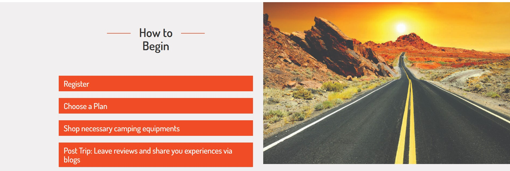
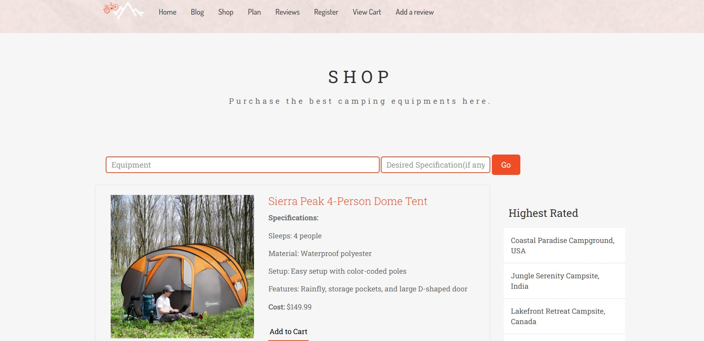
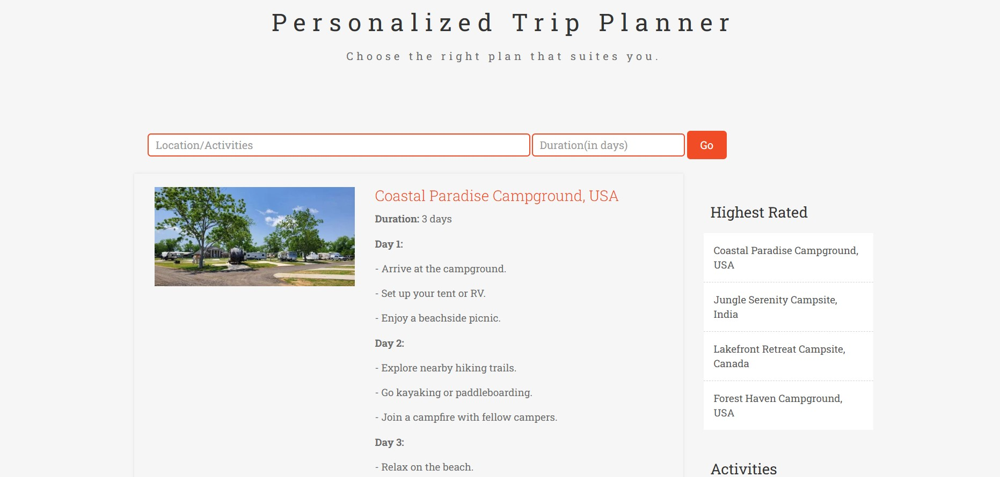
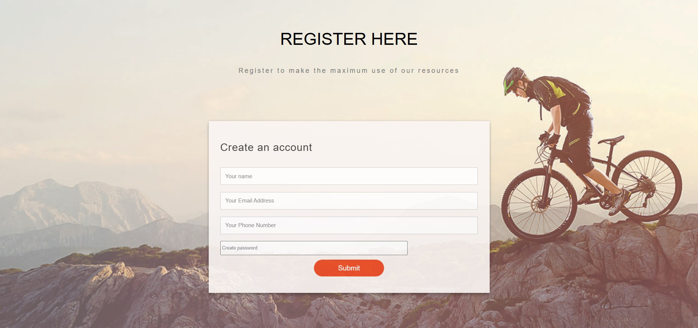

# Camping Buddy
Camping Buddy aims is a web application that provides an online platform that connects camping enthusiasts, offers resources, make plans and promote responsible and enjoyable camping experiences.
At Camping Buddy, we envision a world where everyone has the opportunity to connect with the great outdoors and experience the profound beauty and tranquility of nature. We aspire to be the trusted 
companion for every camper, from novices to experts, as they embark on their adventures. Our vision is to create a global community that fosters a deep appreciation for
nature, encourages sustainable practices, and enhances the joy of camping, making it accessible and enjoyable for all.

## Features

- **Seamless User Registration** - Effortlessly register and become a part of our camping community with a quick and secure sign-up process.
- **Express Yourself with Blogs** - Share your outdoor adventures, tips, and stories by writing and publishing engaging blogs for the camping community.
- **Gear Up at the Camping Store** - Browse and buy top-notch camping equipment to ensure you’re fully prepared for your next adventure.
- **Smart Camping Trip Planner** - Organize your camping trip with ease by planning activities based on your chosen location and the number of days.
- **Personalized Daily Itinerary** - Get a custom-made day-by-day plan detailing activities, destinations, and gear usage for a seamless camping experience.
- **Share Honest Reviews** - Provide valuable feedback on campsites, including activities, amenities, and overall experience, to help fellow campers.
- **Your Camping Cart** - Keep track of your selected camping plans and purchased equipment in a single, easy-to-view cart for better organization.

## Installation Instructions
Follow the steps below to set up the project on your local machine.
### 1. Clone the Repository
Clone the project repository to your local machine using the following command:

```bash
git clone https://github.com/AnnMarryJohn001/Camping-Buddy.git
```
### 2.Navigate to the Project Directory
Once the repository is cloned, navigate into the project folder:
```bash
cd Camping-Buddy/trekking-master/trekking-master
```
### 3. Install Dependencies
Ensure that Node.js and npm are installed on your system. If you don't have them, you can download and install them from Node.js official website.
Once you have Node.js installed, run the following command to install the necessary dependencies:
```bash
npm install
```
### 4. Set Up MySQL Database
Make sure you have MySQL installed and running on your local machine. You can download it from MySQL official website.
#### 4.1. Create a Database
Log in to MySQL and create a new database named camping:
```bash
CREATE DATABASE camping;
```
#### 4.2. Create Tables
After creating the database, create the necessary tables by running the following SQL queries in your MySQL terminal:
```bash
CREATE TABLE users (
    id INT AUTO_INCREMENT PRIMARY KEY,
    name VARCHAR(255) NOT NULL,
    email VARCHAR(255) NOT NULL,
    phone VARCHAR(20),
    password VARCHAR(255) NOT NULL
);

CREATE TABLE bookings (
    id INT AUTO_INCREMENT PRIMARY KEY,
    name VARCHAR(255) NOT NULL,
    password VARCHAR(255) NOT NULL,
    campingsite VARCHAR(255) NOT NULL
);

CREATE TABLE reviews (
    id INT AUTO_INCREMENT PRIMARY KEY,
    name VARCHAR(255) NOT NULL,
    campsitename VARCHAR(255) NOT NULL,
    state VARCHAR(100),
    country VARCHAR(100),
    comments TEXT,
    activities TEXT,
    rating INT NOT NULL
);
```
#### 4.3. Configure Database Connection
In the project directory, open the app.js file and locate the MySQL connection settings:
```bash
const db = mysql.createConnection({
  host: 'localhost',
  user: 'root',
  password: 'MyNewPass',  // Change this to your local MySQL password
  database: 'camping',
});
```
Replace 'MyNewPass' with the password for your MySQL root user (or a specific MySQL user if you're using one).

### 5. Start the Application
Start the application with the following command:
```bash
node app.js
```

### 6. Access the Application
Once the server is running, open your browser and navigate to:
```bash
http://localhost:3000
```
You should now be able to see the application running locally.

## Usage
1. Open the application in your browser at `http://localhost:3000`.
2. Sign up or log in to start exploring features.
3. Search for campsites or create your custom checklist.

## Screenshots
Here a few screenshots of the application:
### Home Page

### Steps on how to proceed

### Shop Camping Equipments

### Personalized Trip Planner

### User Registration Page



## Technologies Used
- **Backend**: Node.js, Express.js, MySQL, MySQL2
- **Frontend**: HTML, CSS, JavaScript
- **Package Management**: npm
- **Version Control**: Git, GitHub
- **Data Parsing**: express.json(), express.urlencoded()

## Author
- [Ann Marry John](https://github.com/AnnMarryJohn001) - Initial work
  


